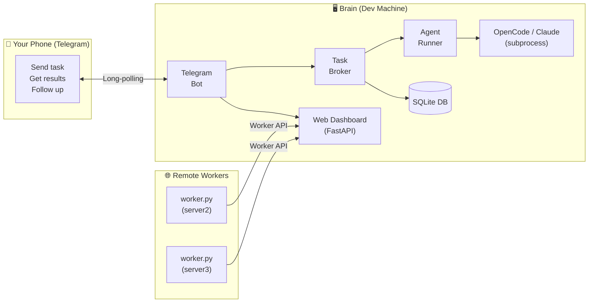
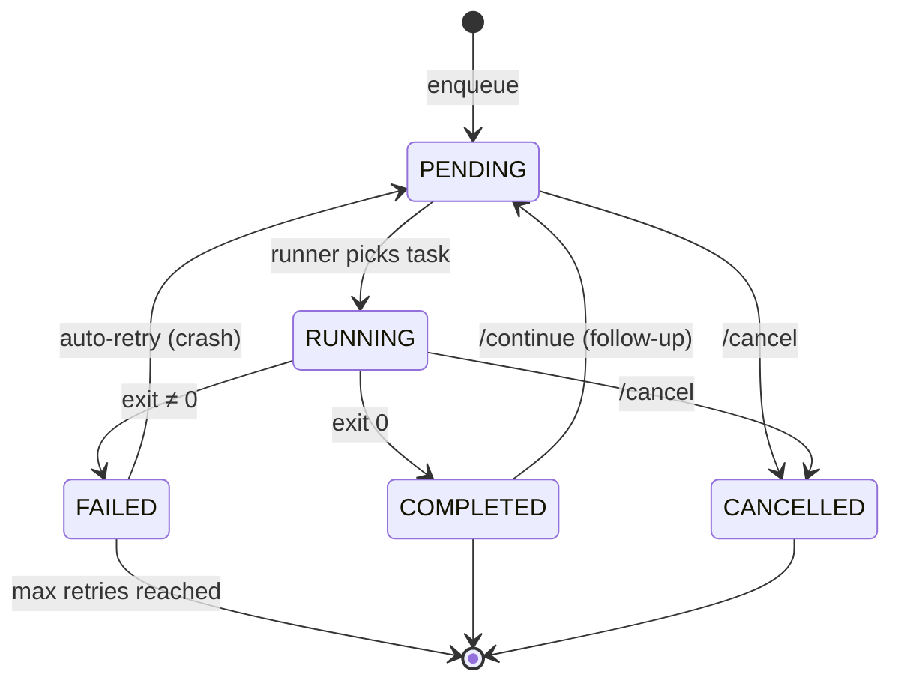

# OpenTask

**Personal Telegram → AI agent bridge. Queue coding tasks from your phone, execute them on your dev machine (or a fleet of remote workers).**

Send a message from your phone → OpenTask dispatches it to your AI coding agent → get results, git diffs, and follow-up conversation — all from Telegram.

---

## Why This Exists

When you step away from your desk — lunch break, commute, overnight — your dev machine sits idle. OpenTask lets you keep it working:

1. Send a natural language task to a Telegram bot
2. OpenTask queues it and dispatches it to your AI coding agent (OpenCode, Claude, etc.)
3. The agent finishes — you get a summary, git diff, and inline buttons back on Telegram
4. Tap **Follow Up** to continue the conversation, or send the next task

No SSH tunnels, no port forwarding, no VPN. Just Telegram long-polling.

## Architecture



### Task Lifecycle



## Features

- **Telegram bot** — queue tasks, monitor progress, get results on your phone
- **Follow-up conversations** — tap "Follow Up" on any completed task to continue the discussion with full context
- **Model selection** — switch between models (sonnet, opus, haiku) per chat or per task
- **Recipes** — smart prompt routing with keyword triggers, setup commands, skills injection, and prompt enrichment
- **Task chains** — define multi-step workflows that run sequentially
- **Repeat tasks** — run a task N times or until a specified time
- **Priority & bump** — tasks have priority levels; `/bump` moves a task to the front
- **Auto-retry** — crashed tasks automatically retry once (configurable max retries)
- **Git diff summaries** — completed tasks include a summary of files changed
- **Task search** — `/search` to find tasks by prompt text
- **Multi-machine workers** — route tasks to remote machines with `@worker` syntax
- **Web dashboard** — real-time monitoring UI with auto-refresh (FastAPI)
- **Persistent reply keyboard** — quick-access buttons for Status, Queue, History, Help
- **Persistent preferences** — project dir, agent, and model saved per chat
- **Crash recovery** — orphaned running tasks/chains recovered on restart
- **Auto-purge** — completed tasks older than 7 days cleaned on startup
- **Progress notifications** — periodic updates while long tasks run
- **Path allowlist** — restrict agent execution to approved directories
- **Shell safety** — all prompts and paths shell-escaped via `shlex.quote`
- **1200+ tests** across 24 test files

## Quick Start

```bash
# 1. Clone
git clone git@github.com:learn-by-exploration/opentask.git
cd opentask

# 2. One-command setup (creates venv, installs deps, runs tests)
bash setup.sh

# 3. Configure
#    Edit .env — add your Telegram bot token and user ID
#    (setup.sh creates .env from the template if it doesn't exist)

# 4. Run
source .venv/bin/activate
python -m app
# Or: make run
```

### Manual Setup

```bash
python3 -m venv .venv && source .venv/bin/activate
pip install -e ".[dev]"
cp .env.example .env   # edit with your config
python -m app
```

### Docker

```bash
# Build and run
docker compose up --build -d

# Logs
docker compose logs -f

# Stop
docker compose down
```

The Docker image installs Python 3.10, Node.js 20, and the Claude CLI. It mounts `./data`, your home directory, and Claude config directories so agents have access to your projects and credentials.

### Systemd Service (Linux)

```ini
# ~/.config/systemd/user/taskpilot.service
[Unit]
Description=TaskPilot — Telegram AI Agent Bridge
After=network.target

[Service]
WorkingDirectory=/home/you/opentask
ExecStart=/home/you/opentask/.venv/bin/python -m app
Restart=on-failure
RestartSec=5

[Install]
WantedBy=default.target
```

```bash
systemctl --user daemon-reload
systemctl --user enable --now taskpilot
journalctl --user -u taskpilot -f   # tail logs
```

### Running in Background (Make)

```bash
make run-bg          # start in background (logs → data/bot.log)
make logs            # tail the log
make stop            # stop the bot
make restart         # stop + start
```

### Prerequisites

- **Python 3.9+** — `python3 --version`
- **An AI coding agent** — at least one of:
  - [OpenCode](https://github.com/opencode-ai/opencode) — `opencode run` (default)
  - [Claude CLI](https://docs.anthropic.com/en/docs/claude-cli) — `claude -p`
- **Telegram account** — create a bot via [@BotFather](https://t.me/BotFather) and get your user ID from [@userinfobot](https://t.me/userinfobot)

---

## Telegram Commands

### Basic

| Command | Action |
|---------|--------|
| *any text* | Queue as a new task (uses current project, agent, model) |
| `/status` | Show running task with elapsed time, model, and worker |
| `/queue` | List pending tasks with priorities |
| `/history [N]` | Recent completed/failed tasks (default 10) |
| `/cancel [id]` | Cancel the running task, or a specific pending task by ID |
| `/output <id>` | Get full output of a task (sent as file if large) |
| `/retry <id>` | Re-queue a failed task |
| `/help` | Show all commands |

### Configuration

| Command | Action |
|---------|--------|
| `/project <path>` | Set working directory (validated against allowlist) |
| `/agent <name>` | Switch agent (`opencode`, `claude`, etc.) |
| `/model <name>` | Set model for future tasks (`sonnet`, `opus`, `haiku`, etc.) |
| `/setmodel <id> <name>` | Change model for a specific pending task |

### Follow-Up Conversations

| Command | Action |
|---------|--------|
| `/continue <id> <prompt>` | Send a follow-up message to a completed task |
| `/cancel_followup` | Exit follow-up conversation mode |
| *Tap "Follow Up" button* | Enter follow-up mode for a completed task — subsequent messages continue that conversation |

When you tap **Follow Up** on a completed task, you enter follow-up mode. Every message you send continues that conversation (the agent uses `--continue` to resume its session). Send `/cancel_followup` to return to normal task queuing.

### Task Chains

| Command | Action |
|---------|--------|
| `/savechain <name> step1 \| step2 \| step3` | Save a multi-step chain |
| `/chain <name>` | Run a saved chain |
| `/chains` | List all saved chains |
| `/delchain <name>` | Delete a chain |

Chains run steps sequentially. If a step fails, the chain stops. Each step can optionally specify an agent and project directory.

### Repeat Tasks

| Command | Action |
|---------|--------|
| `/repeat <N> <prompt>` | Run a task N times |
| `/repeat until:HH:MM <prompt>` | Run repeatedly until the specified time |

### Queue Management

| Command | Action |
|---------|--------|
| `/bump <id>` | Move a pending task to the front of the queue |
| `/search <query>` | Search tasks by prompt text |

### Recipes

| Command | Action |
|---------|--------|
| `/addrecipe <name> triggers:kw1,kw2 [agent:name] [model:name]` | Create a recipe with trigger keywords |
| `/recipes` | List all recipes |
| `/recipe <name>` | Show recipe details |
| `/delrecipe <name>` | Delete a recipe |

---

## Recipes

Recipes enable smart prompt routing. When you send a task, OpenTask checks if any recipe's trigger keywords match your prompt and automatically applies the recipe's configuration.

A recipe can specify:

- **Trigger keywords** — words that activate the recipe (e.g., `ros2`, `rosbag`, `analysis`)
- **Agent override** — use a specific agent for matched tasks
- **Model override** — use a specific model
- **Project directory** — run in a specific directory
- **Setup commands** — shell commands to prepend (e.g., `source /opt/ros/humble/setup.bash`)
- **Skills** — skill package names whose `SKILL.md` to inject into the prompt
- **Prompt prefix/suffix** — text to prepend or append to the user's prompt

### Example

```
/addrecipe ros2 triggers:rosbag,ros2,gazebo agent:claude model:opus
```

Now sending "analyze the rosbag file" automatically uses Claude with the Opus model because "rosbag" matches a trigger.

Skills are loaded from `~/.taskpilot/skills/<skill-name>/SKILL.md` and injected into the prompt at execution time.

---

## Model Selection

Control which model your agent uses:

- **Per-chat default:** `/model sonnet` — all future tasks use this model
- **Per-task override:** `/setmodel <task-id> opus` — change model for a pending task
- **Inline buttons:** Completed tasks show a model info badge; pending tasks can be adjusted
- **Via recipes:** Recipes can set a model for matched prompts

Model names are passed to the agent via configurable flags (e.g., `--model sonnet`). The exact model names depend on your agent. Common values: `sonnet`, `opus`, `haiku`, or full identifiers like `anthropic/claude-sonnet-4`.

---

## Multi-Machine Workers

Distribute tasks across multiple machines. The "brain" (your main dev machine) runs the Telegram bot and web dashboard. Remote "workers" poll the brain for tasks and execute them locally.

### How It Works

1. Send `@server2 fix the login bug` in Telegram — the task is assigned to worker `server2`
2. The worker polls the brain's Worker API, claims the task, and executes it
3. Results are submitted back to the brain and forwarded to you on Telegram
4. Tasks without `@worker` prefix run on the local machine as usual

### Setting Up a Worker

Copy `worker.py` (a single, zero-dependency script) to the remote machine:

```bash
# On the remote machine
python worker.py --brain http://brain-host:8095 --id server2

# Or via environment variables
export TASKPILOT_BRAIN_URL=http://brain-host:8095
export TASKPILOT_WORKER_ID=server2
export TASKPILOT_TOKEN=your-dashboard-token  # if auth is enabled
python worker.py
```

### Worker Configuration

On the brain, set `KNOWN_WORKERS` to show worker buttons in Telegram:

```bash
KNOWN_WORKERS=server2,gpu-box,build-server
```

### Worker API Endpoints

| Endpoint | Method | Purpose |
|----------|--------|---------|
| `/api/worker/claim` | POST | Worker claims the next available task |
| `/api/worker/{id}/result` | POST | Worker submits task results |
| `/api/worker/{id}/heartbeat` | POST | Worker sends periodic heartbeat |
| `/api/workers` | GET | List active workers |

### Worker Environment Variables

| Variable | Default | Description |
|----------|---------|-------------|
| `TASKPILOT_BRAIN_URL` | — | Brain server URL (e.g., `http://192.168.1.10:8095`) |
| `TASKPILOT_WORKER_ID` | — | Unique worker identifier |
| `TASKPILOT_TOKEN` | *(empty)* | Bearer token if dashboard auth is enabled |
| `TASKPILOT_POLL_INTERVAL` | `5` | Seconds between polls |

### Reliability

- Workers send heartbeats every 30 seconds
- Stale tasks (no heartbeat for >120 seconds) are automatically recovered to PENDING
- Recovery runs on startup and before each claim attempt
- `pick_next_task()` skips tasks with `assigned_to` set — local and remote work coexist

---

## Web Dashboard

The web dashboard runs alongside the bot at `http://127.0.0.1:8095`:

- **Stats overview** — queue depth, completed/failed counts, average duration
- **Running task** — highlighted card with elapsed time
- **Queue view** — pending tasks with priority levels
- **Recent tasks** — status, agent, model, prompt, duration
- **Chains** — all saved chains with status
- **Auto-refresh** — live updates every 5 seconds
- **Optional auth** — set `DASHBOARD_TOKEN` in `.env` for bearer token protection

### JSON API

| Endpoint | Method | Description |
|----------|--------|-------------|
| `/api/health` | GET | Health check |
| `/api/stats` | GET | Queue depth, task counts, average duration |
| `/api/tasks` | GET | List recent tasks |
| `/api/tasks/{id}` | GET | Get a specific task |
| `/api/queue` | GET | List pending tasks |
| `/api/chains` | GET | List all chains |
| `/api/chains/{id}` | GET | Get a specific chain |
| `/` | GET | HTML dashboard UI |

---

## Key Design Decisions

| Decision | Choice | Why |
|----------|--------|-----|
| Interface | Telegram bot | Works from any phone, no app to build, no server needed |
| Transport | Long-polling | No public IP / port forwarding required. Works behind NAT, corp firewalls |
| Agent | OpenCode + Claude | Extensible via `AGENT_COMMANDS` — any CLI agent can be added |
| Queue | SQLite (async) | Zero-setup, survives restarts, single-user scale is fine |
| Execution | Subprocess | Simple, isolated, timeout-able. One task at a time per machine |
| Auth | Telegram user ID allowlist | Simple, effective for personal use |
| Dashboard | FastAPI | Lightweight, async, same process. Auth via bearer token |
| Workers | Pull-based polling | Workers behind NAT can reach the brain; no inbound ports needed |
| Shell safety | `shlex.quote` | All user input shell-escaped before subprocess execution |
| Follow-ups | Agent `--continue` flag | Resumes agent session for conversational workflows |
| Retry | Auto-retry on crash | Tasks that fail with non-zero exit retry up to `max_retries` times |
| Git diffs | Post-task `git diff` | Captures what files changed during agent execution |

---

## Environment Variables

| Variable | Required | Default | Description |
|---|---|---|---|
| `TELEGRAM_BOT_TOKEN` | yes | — | From @BotFather |
| `ALLOWED_USER_IDS` | yes | — | Comma-separated Telegram user IDs |
| `DEFAULT_AGENT` | no | `opencode` | Agent to use by default |
| `DEFAULT_PROJECT_DIR` | no | `~/ai` | Working directory for tasks |
| `DEFAULT_MODEL` | no | *(empty)* | Default model (e.g., `sonnet`). Empty = agent default |
| `ALLOWED_PROJECT_DIRS` | no | `~/ai,~/repos,~/projects` | Directories the agent may run in |
| `AGENT_COMMANDS` | no | *(built-in)* | JSON map: agent name → command template (use `{prompt}` and `{project_dir}` placeholders) |
| `AGENT_MODEL_FLAGS` | no | *(built-in)* | JSON map: agent name → model flag template (e.g., `--model {model}`) |
| `AGENT_CONTINUE_FLAGS` | no | *(built-in)* | JSON map: agent name → continue/session flag (e.g., `--continue`) |
| `TASK_TIMEOUT_SECONDS` | no | `1800` | Max seconds per task (30 min) |
| `MAX_QUEUE_SIZE` | no | `20` | Max pending+running tasks |
| `PROGRESS_INTERVAL_SECONDS` | no | `30` | Seconds between progress notifications |
| `DB_PATH` | no | `./data/taskpilot.db` | SQLite database path |
| `OUTPUT_SUMMARY_MAX_CHARS` | no | `500` | Max characters for output summaries in Telegram |
| `SKILLS_DIR` | no | `~/.taskpilot/skills` | Directory for recipe skill packages |
| `KNOWN_WORKERS` | no | *(empty)* | Comma-separated worker names for Telegram buttons |
| `DASHBOARD_ENABLED` | no | `true` | Enable/disable web dashboard |
| `DASHBOARD_HOST` | no | `127.0.0.1` | Dashboard listen address |
| `DASHBOARD_PORT` | no | `8095` | Dashboard listen port |
| `DASHBOARD_TOKEN` | no | *(empty)* | Bearer token for dashboard auth |

---

## Project Structure

```
opentask/
├── app/
│   ├── __init__.py
│   ├── __main__.py              # Entrypoint: bot + runner + dashboard
│   ├── config/
│   │   └── settings.py          # Pydantic settings from .env
│   ├── core/
│   │   ├── models.py            # Task, TaskChain, ChatPrefs, Recipe (SQLAlchemy)
│   │   ├── db.py                # Async engine + session factory (aiosqlite)
│   │   ├── broker.py            # Queue CRUD, chains, prefs, recipes, recovery, workers
│   │   └── runner.py            # Agent subprocess execution with timeout + git diff
│   ├── telegram/
│   │   └── bot.py               # 25 commands, auth, inline buttons, notifications
│   └── web/
│       └── dashboard.py         # FastAPI dashboard (HTML + JSON API + Worker API)
├── worker.py                    # Standalone remote worker (zero external deps)
├── tests/                       # 1200+ tests across 24 files
│   ├── conftest.py              # In-memory SQLite fixtures
│   ├── test_broker.py           # Core broker operations
│   ├── test_runner.py           # Command building + summarization
│   ├── test_bot.py              # All Telegram handlers
│   ├── test_chains.py           # Chain CRUD and execution
│   ├── test_web_dashboard.py    # Dashboard API + auth + HTML
│   ├── test_qa_security.py      # Security and edge cases
│   ├── test_models.py           # ORM models
│   ├── test_settings.py         # Settings validation
│   ├── test_chat_prefs.py       # Per-chat preferences
│   └── ...                      # Additional coverage suites
├── docs/
│   ├── architecture/
│   │   └── overview.md
│   └── design/
│       ├── spec.md
│       └── kickoff-discovery-coverage.md
├── Dockerfile
├── docker-compose.yml
├── .env.example
├── pyproject.toml
├── Makefile
├── setup.sh
├── CLAUDE.md
└── README.md
```

## Components

| Component | File | Purpose |
|-----------|------|---------|
| Config | `app/config/settings.py` | Pydantic settings from `.env` |
| Models | `app/core/models.py` | Task, TaskChain, ChatPrefs, Recipe — SQLAlchemy ORM |
| Broker | `app/core/broker.py` | Queue CRUD, chains, prefs, recipes, recovery, worker functions |
| Runner | `app/core/runner.py` | Subprocess execution with timeout, output capture, git diff, summarization |
| Bot | `app/telegram/bot.py` | 25 Telegram commands, inline buttons, follow-up mode, notifications |
| Dashboard | `app/web/dashboard.py` | FastAPI web dashboard with HTML UI + JSON API + Worker API |
| Worker | `worker.py` | Standalone remote worker client (zero external dependencies) |
| Entrypoint | `app/__main__.py` | Starts bot + runner + dashboard concurrently via asyncio |

---

## Makefile Commands

| Command | Description |
|---------|-------------|
| `make setup` | Full setup via setup.sh |
| `make install` | Install all dependencies into .venv |
| `make run` | Run in foreground |
| `make run-bg` | Run in background (logs → data/bot.log) |
| `make stop` | Stop background process |
| `make restart` | Stop + start in background |
| `make logs` | Tail the bot log |
| `make test` | Run all tests (verbose) |
| `make test-quick` | Quick test (stop on first failure) |
| `make clean` | Remove caches and build artifacts |

## Running Tests

```bash
source .venv/bin/activate
make test              # verbose
make test-quick        # stop on first failure
# Or directly: pytest tests/ -v
```

## License

MIT
