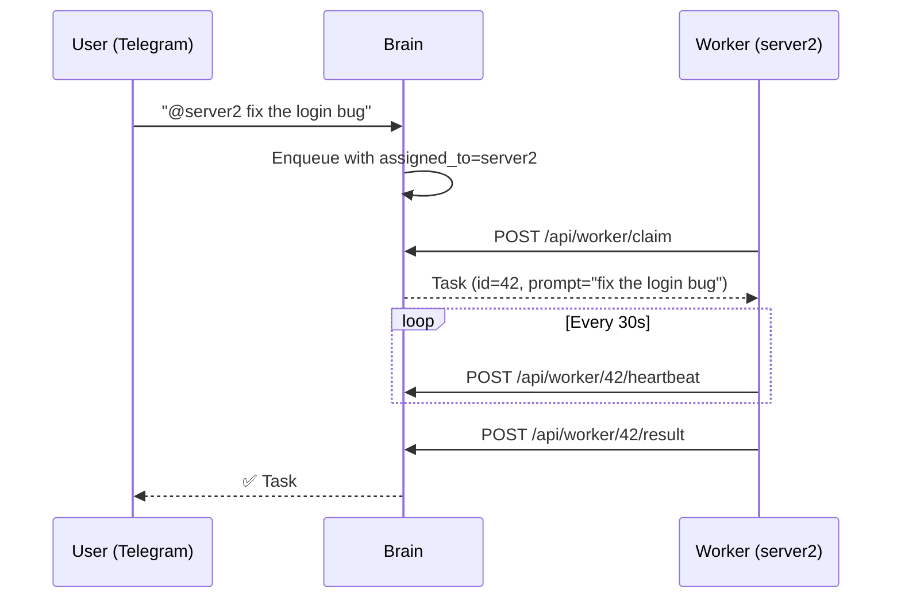

# Remote Workers

Distribute tasks across multiple machines. The "brain" (your main dev machine) runs the Telegram bot and web dashboard. Remote "workers" poll the brain for tasks and execute them locally.

## How It Works



1. Send `@server2 fix the login bug` in Telegram — the task is assigned to worker `server2`
2. The worker polls the brain's Worker API, claims the task, and executes it
3. Results are submitted back to the brain and forwarded to you on Telegram
4. Tasks **without** `@worker` prefix run on the local machine as usual

## Setting Up a Worker

Copy `worker.py` (a single, zero-dependency script) to the remote machine:

```bash
# On the remote machine
python worker.py --brain http://brain-host:8095 --id server2

# Or via environment variables
export TASKPILOT_BRAIN_URL=http://brain-host:8095
export TASKPILOT_WORKER_ID=server2
export TASKPILOT_TOKEN=your-dashboard-token  # if auth is enabled
python worker.py
```

## Brain Configuration

On the brain, set `KNOWN_WORKERS` to show worker selection buttons in Telegram:

```bash
KNOWN_WORKERS=server2,gpu-box,build-server
```

## Worker API Endpoints

| Endpoint | Method | Purpose |
|----------|--------|---------|
| `/api/worker/claim` | POST | Worker claims the next available task |
| `/api/worker/{id}/result` | POST | Worker submits task results |
| `/api/worker/{id}/heartbeat` | POST | Worker sends periodic heartbeat |
| `/api/workers` | GET | List active workers |

## Worker Environment Variables

| Variable | Default | Description |
|----------|---------|-------------|
| `TASKPILOT_BRAIN_URL` | — | Brain server URL (e.g., `http://192.168.1.10:8095`) |
| `TASKPILOT_WORKER_ID` | — | Unique worker identifier |
| `TASKPILOT_TOKEN` | *(empty)* | Bearer token if dashboard auth is enabled |
| `TASKPILOT_POLL_INTERVAL` | `5` | Seconds between polls |

## Reliability

- Workers send heartbeats every **30 seconds**
- Stale tasks (no heartbeat for **>120 seconds**) are automatically recovered to PENDING
- Recovery runs on startup and before each claim attempt
- `pick_next_task()` skips tasks with `assigned_to` set — local and remote work coexist
- Workers have zero external dependencies — just `python worker.py`
