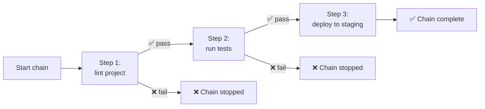
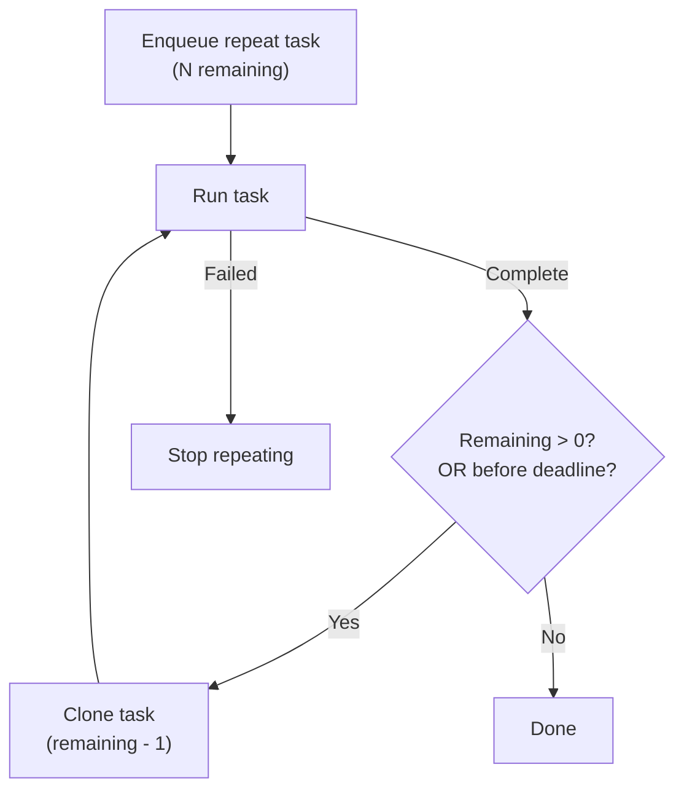

# Task Chains & Repeats

## Task Chains

Chains are named multi-step workflows that run sequentially. If a step fails, the chain stops.

### Creating a Chain

```
/savechain deploy lint project | run tests | deploy to staging
```

Steps are separated by `|`. Each step can optionally specify an agent and project directory.

### Running a Chain

```
/chain deploy
```



### Managing Chains

```
/chains              — list all saved chains
/chain <name>        — run a chain
/delchain <name>     — delete a chain
```

### Recovery

If the process restarts while a chain is running, orphaned chains are recovered on startup and marked as failed. You can re-run them with `/chain <name>`.

## Repeat Tasks

### Fixed Count

```
/repeat 5 run the test suite
```

Runs the task 5 times sequentially.

### Until a Time

```
/repeat until:18:00 check for new PRs and review them
```

Keeps running the task repeatedly until 18:00 (local time).

### How Repeats Work



Each repeat creates a new task with `repeat_remaining` decremented by 1. Failed tasks stop the repeat cycle.
