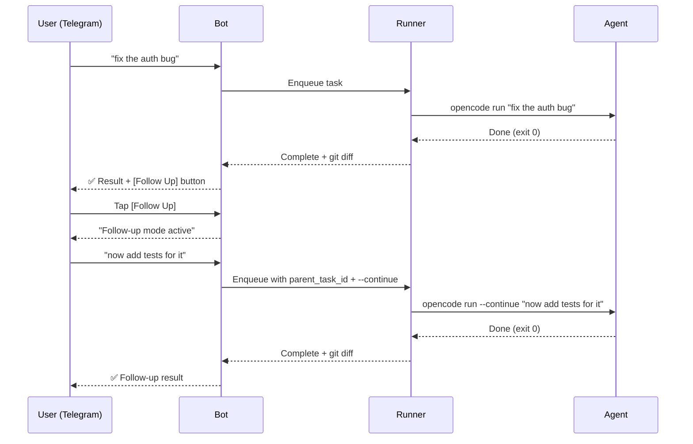

# Follow-Up Conversations

Continue working with the AI agent on a completed task — the agent resumes its session with full context.

## How It Works



## Using Follow-Up Mode

1. A task completes — you see a **Follow Up** button on the result message
2. Tap the button — the bot enters follow-up mode for that task
3. Send any text message — it becomes a follow-up task that continues the agent's session
4. The agent uses `--continue` to resume context from the original task
5. Send `/cancel_followup` to exit follow-up mode and return to normal task queuing

## Direct Follow-Up (Without Mode)

Skip follow-up mode and send a one-off follow-up:

```
/continue <task-id> now add tests for it
```

This creates a single follow-up task linked to the specified task.

## Configuration

The `--continue` flag is configurable per agent:

| Variable | Default |
|----------|---------|
| `AGENT_CONTINUE_FLAGS` | `{"opencode": "--continue", "claude": "--continue"}` |
