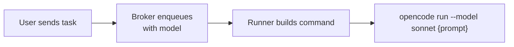

# Model Selection

Control which model your AI agent uses — per chat, per task, or via recipes.

## Setting a Default Model

```
/model sonnet
```

All future tasks in this chat will use the `sonnet` model. The setting is persisted in the database.

## Per-Task Override

```
/setmodel <task-id> opus
```

Changes the model for a specific pending task without affecting the chat default.

## Via Recipes

Recipes can set a model for matched prompts. See [Recipes](guide/recipes.md).

## How It Works

Model names are passed to the agent via configurable flags:



The exact model names depend on your agent. Common values:
- `sonnet`, `opus`, `haiku` — short aliases
- `anthropic/claude-sonnet-4` — full identifiers

## Configuration

| Variable | Default | Description |
|----------|---------|-------------|
| `DEFAULT_MODEL` | *(empty)* | Default model for all tasks. Empty = agent default |
| `AGENT_MODEL_FLAGS` | `{"opencode": "--model {model}", "claude": "--model {model}"}` | How to inject model into agent command |
