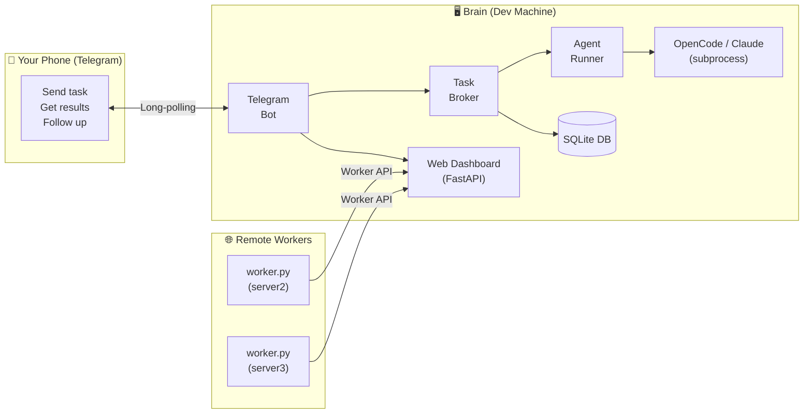
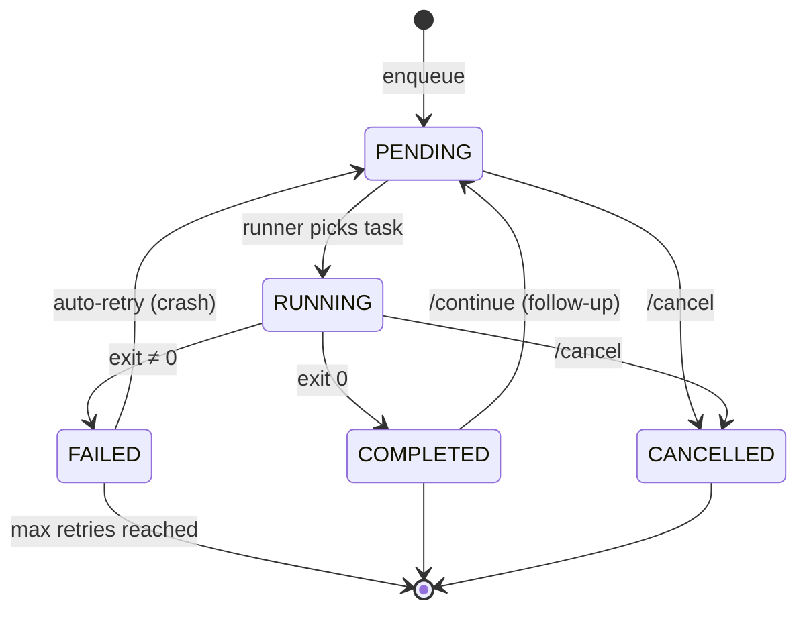

# OpenTask

> **Personal Telegram → AI agent bridge.**
> Queue coding tasks from your phone, execute them on your dev machine (or a fleet of remote workers).

Send a message from your phone → OpenTask dispatches it to your AI coding agent → get results, git diffs, and follow-up conversation — all from Telegram.

No SSH tunnels, no port forwarding, no VPN. Just Telegram long-polling.

## Architecture

## Task Lifecycle

## Features

- **Telegram bot** — queue tasks, monitor progress, get results on your phone
- **Follow-up conversations** — tap "Follow Up" on any completed task to continue the discussion
- **Model selection** — switch between models (sonnet, opus, haiku) per chat or per task
- **Recipes** — smart prompt routing with keyword triggers, setup commands, skills, and prompt enrichment
- **Task chains** — multi-step workflows that run sequentially
- **Repeat tasks** — run a task N times or until a specified time
- **Priority & bump** — `/bump` moves a task to the front of the queue
- **Auto-retry** — crashed tasks automatically retry (configurable max retries)
- **Git diff summaries** — completed tasks include a summary of files changed
- **Task search** — find tasks by prompt text
- **Multi-machine workers** — route tasks to remote machines with `@worker` syntax
- **Web dashboard** — real-time monitoring UI with auto-refresh
- **Persistent reply keyboard** — quick-access buttons for Status, Queue, History, Help
- **Crash recovery** — orphaned running tasks/chains recovered on restart
- **Auto-purge** — completed tasks older than 7 days cleaned on startup
- **Shell safety** — all prompts and paths shell-escaped via `shlex.quote`
- **1200+ tests** across 24 test files

## Quick Links

- [Telegram Commands](guide/commands.md) — all 25 bot commands
- [Quick Start](deploy/quickstart.md) — get running in 2 minutes
- [Docker Deployment](deploy/docker.md) — containerized setup
- [Remote Workers](deploy/workers.md) — distribute tasks across machines
- [Environment Variables](reference/env.md) — full configuration reference
- [Dashboard & API](reference/dashboard.md) — web UI and JSON API

## Design Decisions

| Decision | Choice | Why |
|----------|--------|-----|
| Interface | Telegram bot | Works from any phone, no app to build |
| Transport | Long-polling | No public IP / port forwarding required |
| Agent | OpenCode + Claude | Extensible via `AGENT_COMMANDS` |
| Queue | SQLite (async) | Zero-setup, survives restarts |
| Execution | Subprocess | Simple, isolated, timeout-able |
| Auth | Telegram user ID allowlist | Simple, effective for personal use |
| Dashboard | FastAPI | Lightweight, async, same process |
| Workers | Pull-based polling | Workers behind NAT can reach the brain |
| Shell safety | `shlex.quote` | All input shell-escaped |
| Follow-ups | Agent `--continue` flag | Resumes agent session |
| Retry | Auto-retry on crash | Automatic recovery from transient failures |
| Git diffs | Post-task `git diff` | See what files changed |
